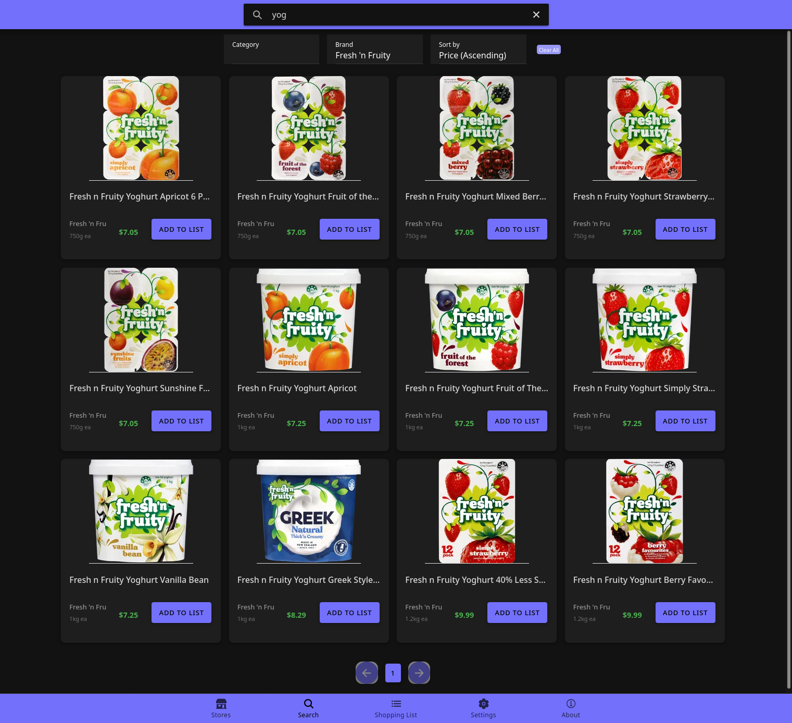

# Grocery Comparison Application

A simple grocery comparison app to help users find the best prices for their groceries across multiple supermarkets.

This project was developed in cooperation with Anne-Jan Veendijk, Haosheng Ye,  Nandhini Sambasivam, Sam Williams, and Yuchuan Jin.

## Setup

This project uses Docker Compose for development, testing, and production.

The project includes a scraper for [Grocer](https://grocer.nz/). In order to spare their services the instructions below exclude scraping their data. Instead, we simple import some pre-scraped data.

*Windows setup*
```
docker compose --profile app up --build
docker cp res/demo_data.sql db:demo_data.sql
docker exec -it db psql -U grocery_compare -h localhost grocery_prices_dev -f demo_data.sql
```
*Linux setup*
```
sudo docker compose --profile app up --build
sudo docker cp res/demo_data.sql db:demo_data.sql
sudo docker exec -it db psql -U grocery_compare -h localhost grocery_prices_dev -f demo_data.sql
# open http://localhost:5173/ in a browser.
```

### Profiles

To launch a specific profile. For example, the frontend and backend run: `sudo docker compose --profile backend --profile frontend up`. See [Docker profiles docs](https://docs.docker.com/compose/how-tos/profiles/) for more information.

Available profiles:

- `app`
- `backend`
- `migrate`
- `frontend`
- `scraper`
- `backend_test`
- `e2e_test`

## Features

- Product search
- Filtering and sorting search results
- Price history
- Shopping list
- Retrieve pricing data from [Grocer](https://grocer.nz/).
- Dark mode



